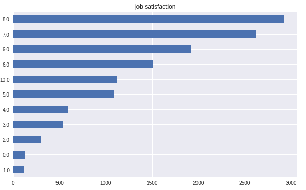
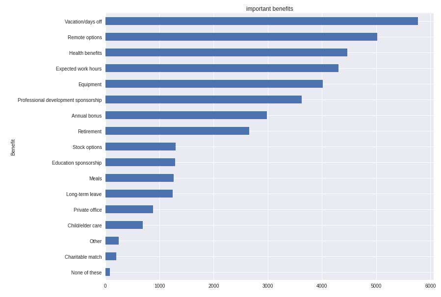
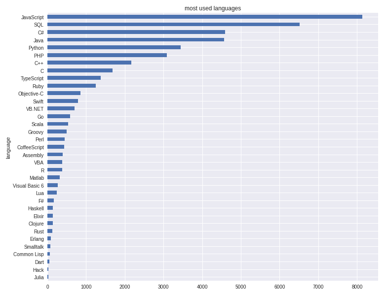

# Github Survey Analysis
Data analysis on github developer survey taken from kaggle https://www.kaggle.com/stackoverflow/so-survey-2017
The current analysis is focused on job statistics.


# Installation

```
pip install numpy
pip install jupyter-notebook
pip install matplotlib
pip install pandas
pip install scikit-learn
```

# Business Questions
- **Q**: Is being a developer a regarding job?
- **A**: We can say for the general response in job satisfaction that it is. Although looking at the question on wether you would work as a developer again if money weren't an issue, one could tell it is not as regarding as you can imagine after all.



- **Q**: What makes a developer feel satisfied with his work?
- **A**: Developers value different many things, but the within the ones that caused more satisfactions we can find home remote options, vacations and payment.



- **Q**: what languages are the most used for jobs?
- **A**: It is no wonder JavaSript is at first place, many technologies are built with javascript, as nodejs, angular, etc. You can even create a whole aplication only with javascript. In second place there is SQL, even though it is not exactly a programing language it is essential for implementing a relational database in your system. In third place there is C#, with the introduction to open source with .netcore there could be more users. Bellow we can find other popular languages as Python, Java an PHP.



# Modeling

A linear regression is made to check which variables are more important in determining job satisfaction, model is overfitted for now but for future actualization of this study more features are being added and analized.